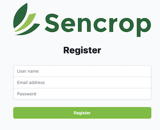

# Sencrop Weather Data

The solutions must be implemented in React \
Otherwise, you are free to use the libraries of your choice

You can also you the tools of your choice

No pressure about time, what matters the most is code and product quality, not the end result

There are two parts:
- registering
- weather data

You can start by the section of your choice

## Registering

We need to create a registering screen for new user

We need three data about the user:

- its name
- its email address
- its password

To register an user, send a POST request to https://reqres.in/api/register

The schema for the body is like this:

```
{
  "userName": string,
  "email": string,
  "password": string
}
```

If the request is successful, the HTTP code will be 200 \
If the request is a failure, the HTTP code will be 400, and the body of the response will be

```
{
    "error": string
}
```

> Note that this API will only work for users it already knows, for example michael.lawson@reqres.in will work but
> user@sencrop.com won't. The form validation should only do semantic validation (i.e. the value in the email
> field is truly an email address)

If the register is successful, display a message saying so \
If the register fails, display a message explaining why



## Weather data

You can retrieve weather data from these two URLs:

https://assets.sencrop.com/data-examples/daily.json for daily data \
https://assets.sencrop.com/data-examples/hourly.json for hourly data

You can display these data in a chart

The x axis must display date \
The y axis must display the key for the data

## Available Scripts

In the project directory, you can run:

### `npm start`

Runs the app in the development mode.\
Open [http://localhost:3000](http://localhost:3000) to view it in the browser.

The page will reload if you make edits.\
You will also see any lint errors in the console.

### `npm test`

Launches the test runner in the interactive watch mode.\
See the section about [running tests](https://facebook.github.io/create-react-app/docs/running-tests) for more information.

